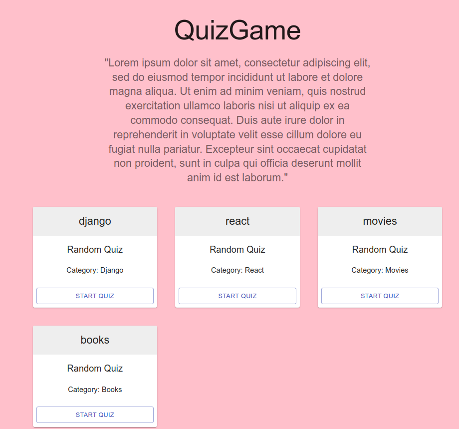

# DRF-React-Quiz

#  About
### Quiz game made with Django Rest Framework & React. User can attempt to answer questions correctly about a certain or variety of subjects.

<p align="center">

<br/>
Choose quiz topic 
<br/>
<br/>

<br/>
Answer random single or multiple choice questions 
<br/>
<br/>

<br/>
Create your own categories, quizzes & questions 
</p>


# How to run
### Clone the project

```
git clone https://github.com/Kacper-Cyganik/DRF-React-Quiz.git
```
## django server
```
pip install -r requirements.txt
```

### Make migrations and run server
```
python3 manage.py makemigrations
python3 manage.py migrate
```
```
python3 manage.py runserver
```

## react

### Install all the npm packages. Go into the project folder and type the following command to install all npm packages
```
npm install

```
### In order to run the application Type the following command
```
npm start
```
